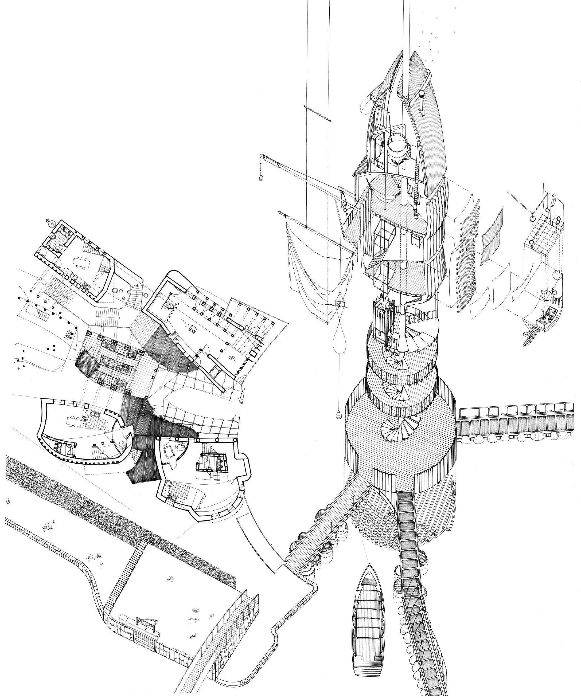
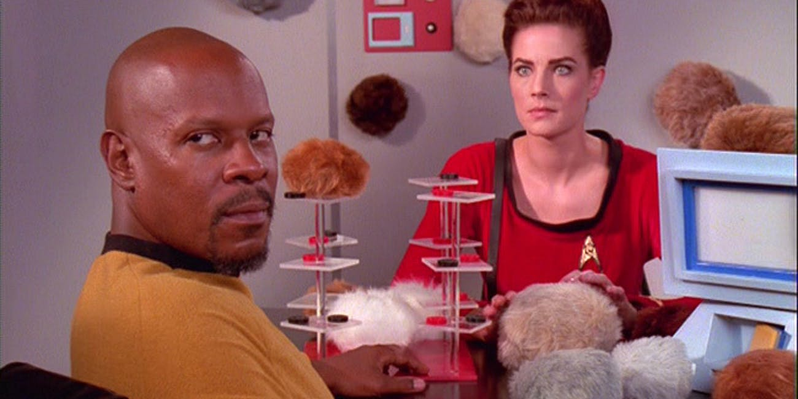
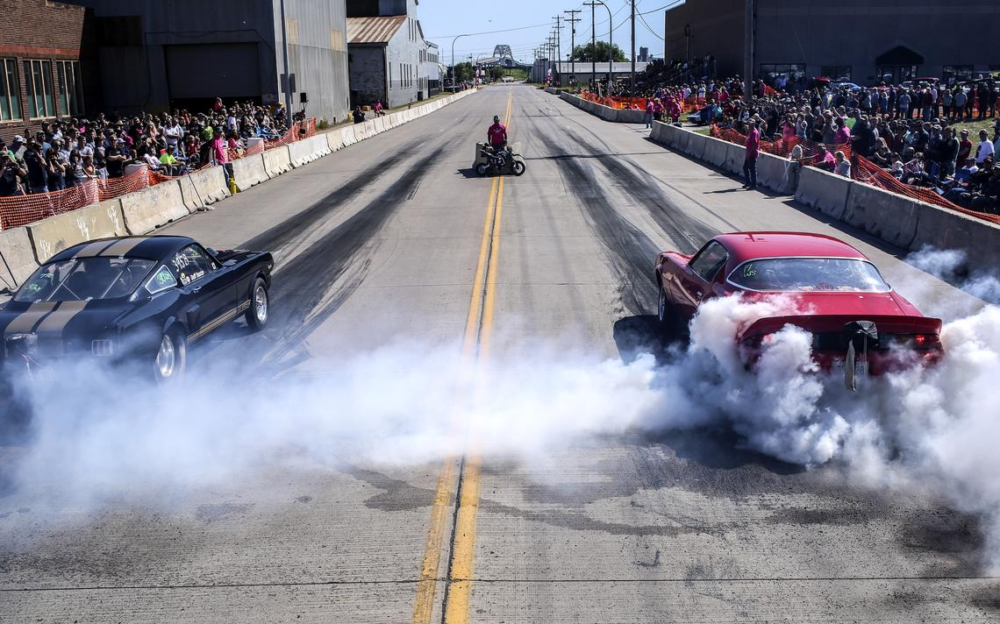
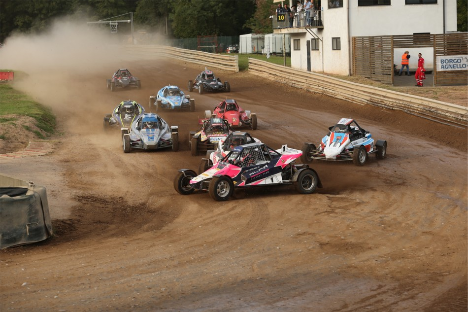

<!-- .slide: data-background="./race-drag.png" -->

NOTES:

- SLOW DOWN
- With that in hand, let's go back to our micro-benchmarks and see how they
  perform.

---

<!-- .slide: data-background="./race-drag.png" -->

```
LockFreeEnv BEFORE:
  threads:2   insert_hit_ratio=0.916 remove_hit_ratio=0.916
  threads:4   insert_hit_ratio=0.967 remove_hit_ratio=0.967
  threads:8   insert_hit_ratio=0.888 remove_hit_ratio=0.888
  threads:16  insert_hit_ratio=0.710 remove_hit_ratio=0.710
  threads:32  insert_hit_ratio=0.446 remove_hit_ratio=0.445
  threads:64  insert_hit_ratio=0.403 remove_hit_ratio=0.402
```

```
LockFreeEnv AFTER:
  threads:2   insert_hit_ratio=0.979 remove_hit_ratio=0.979
  threads:4   insert_hit_ratio=0.992 remove_hit_ratio=0.992
  threads:8   insert_hit_ratio=0.980 remove_hit_ratio=0.980
  threads:16  insert_hit_ratio=0.999 remove_hit_ratio=0.999
  threads:32  insert_hit_ratio=0.998 remove_hit_ratio=0.996
  threads:64  insert_hit_ratio=0.998 remove_hit_ratio=0.998
```

[f97cacc](https://github.com/google/tcmalloc/commit/f97cacc6fc09876e12b55f7987d444820047f083) <!-- .element: class="github" -->

NOTES:

- SLOW DOWN
- That looks really solid!  We never miss an opportunity to cross polinate now!

---

<!-- .slide: data-background="./race-drag.png" -->

```json
BM_Draining<TransferCacheEnv>
  threads:2   insert_hit_ratio=0.944 remove_hit_ratio=0.943
  threads:4   insert_hit_ratio=0.813 remove_hit_ratio=0.813
  threads:8   insert_hit_ratio=0.923 remove_hit_ratio=0.923
  threads:16  insert_hit_ratio=0.918 remove_hit_ratio=0.918
  threads:32  insert_hit_ratio=0.925 remove_hit_ratio=0.924
  threads:64  insert_hit_ratio=0.891 remove_hit_ratio=0.890
```
```json
BM_Draining<LockFreeEnv>
  threads:2   insert_hit_ratio=0.979 remove_hit_ratio=0.979
  threads:4   insert_hit_ratio=0.992 remove_hit_ratio=0.992
  threads:8   insert_hit_ratio=0.980 remove_hit_ratio=0.980
  threads:16  insert_hit_ratio=0.999 remove_hit_ratio=0.999
  threads:32  insert_hit_ratio=0.998 remove_hit_ratio=0.996
  threads:64  insert_hit_ratio=0.998 remove_hit_ratio=0.998
```

[f97cacc](https://github.com/google/tcmalloc/commit/f97cacc6fc09876e12b55f7987d444820047f083) <!-- .element: class="github" -->

NOTES:

- SLOW DOWN
- In fact, we get better hit rates then the old system.
- Let's take this puppy for a spin!

---

<!-- .slide: data-background="./dog-sniffing-tail.png" -->

NOTES:

- SLOW DOWN
- That was not quite what I meant...

-----

<!-- .slide: data-background="./race-autocross.png" -->

NOTES:

- SLOW DOWN
- That's better

---

<!-- .slide: data-background="./race-autocross.png" -->

```json
-- total:qps --
base: XXXXX.XX ±XX (8 trials, 8.0 robust values)
test: YYYYY.YY ±XX (8 trials, 8.0 robust values)
diff: -0.22% ±0.817%
Not significant (p=0.727)
```

NOTES:

- SLOW DOWN
- Well, that looks like it is performance neutral.  I guess I was hoping for
  something more clear.  Maybe I will scout around for other systems to run it
  on.

---

<!-- .slide: data-background="./race-autocross.png" -->


NOTES:

- SLOW DOWN
- Yeah, I actually did try it out on a car.  It was still within the margin of
  error.  If you squint possibly a performance loss, but nothing clear cut.

---

<!-- .slide: data-background="./race-autocross.png" -->

```json
BM_DiffMediumSizedQuery/threads:16  
  3.97s ± 2%   4.11s ± 1%  +3.49%  (p=0.008 n=5+5)
```

NOTES:

- SLOW DOWN
- Eventually, I found a different thing somewhere between a benchmark and a
  system test that had a firm opinion. 3.5% slower.

-----

<!-- .slide: data-background="./treasure.png" -->
<!-- .slide: data-background-size="contain" -->
<!-- .slide: data-background-color="white" -->









NOTES:

- SLOW DOWN
- ADVANCE: we refactored some code, which always just feels good
- ADVANCE: we added some multi-threaded fuzz tests
- ADVANCE: we got to debug an ABA issue
- ADVANCE: we learned how our benchmarks resembled production
- ADVANCE: or really how they didn't resemble it, but how we can improve it
- ADVANCE: we got to track down a few bugs in our implementation

-----

<!-- .slide: data-background="./adventure.png" -->

NOTES:

- SLOW DOWN
- Also, it has given me a really good idea, for a clever concurrent data
  structure.
- What if we build on the existing thing but use elimination buckets and flat
  combinging when there is high contention?

---

<!-- .slide: data-background="./adventure.png" -->

[Flat Combine](http://people.csail.mit.edu/shanir/publications/Flat%20Combining%20SPAA%2010.pdf) <!-- .element: class="github" -->
[Elimination Buckets](https://people.csail.mit.edu/shanir/publications/Lock_Free.pdf) <!-- .element: class="github" style="margin-left: 100px" -->

NOTES:

- SLOW DOWN
- Maybe next year...


---

<!-- .slide: data-background="./adventure.png" -->

#### Questions? <!-- .element: class="background" style="border-radius: 10px" -->

NOTES:

- SLOW DOWN
- Also, it has given me a really good idea, for a clever concurrent data
  structure.
- What if we build on the existing thing but use elimination buckets and flat
  combinging when there is high contention?

